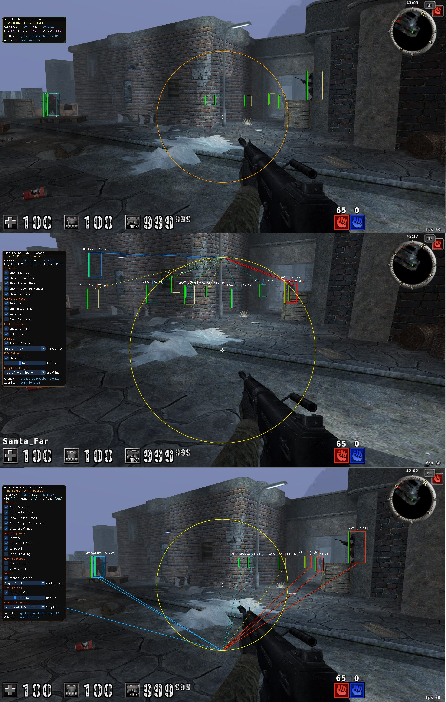

### AssaultCube Internal Cheat – Aimbot & ESP

**By BobBuilder / Raphael**

This is a fully featured **internal Aimbot and ESP** for *AssaultCube v1.3.0.2*.
It is part of a larger writeup that teaches how to reverse engineer a game and build a complete cheat from scratch.

**Article** : [Link to article](https://adminions.ca/books/articles/page/part-2-from-reverse-engineering-to-cheat-development-internal-game-hacks-with-assaultcube)

**Youtube Demo**: 
[](https://www.youtube.com/watch?v=O_oeZ3_XAl0)


**Screenshot**:



#### Features
* Internal **ESP overlay** (DirectX9 + ImGui)
* Configurable **Aimbot** with hotkey & FOV support
* **Silent Aim** (function hook)
* **Instant Kill** (damage hook)
* **Noclip**, **No Recoil**, **Unlimited Ammo**, **Godmode**, and **Fast Shooting**
* Dynamic animated ImGui menu
* Self-contained DLL — **no external memory reads or OpenGL hooks**

#### Technologies Used
* C++ (x86)
* [MinHook](https://github.com/TsudaKageyu/minhook) – API hooking
* Direct3D9 + ImGui – Overlay and rendering
* IDA Pro + runtime debugging – Reversing


#### Project Structure
```
/AssaultCubeInternal/
├── main.cpp             # DLL entry point and cheat thread loop
├── globals.h/.cpp       # Global constants, settings, game offsets
├── vec.h                # Math structs: Vec2, Vec3, angle math
├── player.h/.cpp        # Player struct wrapper (direct memory access)
├── cheats.h/.cpp        # ESP, aimbot, recoil, noclip, BuildPlayerList()
├── render.h/.cpp        # ImGui overlay using external-style D3D9 window
├── structs.h            # Raw reversed structs: PlayerStruct, WeaponEntry
├── MinHook.h            # Hooking API
├── hook.c               # MinHook internals
├── trampoline.c/.h      # MinHook trampoline infrastructure
├── buffer.c/.h          # MinHook memory allocator
├── hde32.c/.h           # MinHook x86 disassembler
├── imgui.ini            # UI layout for ImGui
├── pstdint.h            # MinHook dependency
├── table32.h            # MinHook dependency
```

#### Educational Project
This repository is part of a hands-on article that walks through:

* Reversing player structs and view/collision logic
* Hooking game internals with MinHook
* ESP and aimbot implementation from scratch


**Author:** [BobBuilder / Raphael](https://adminions.ca/books/the-team/page/bobbuilder)
**License:** [GNU GPLv3](https://www.gnu.org/licenses/gpl-3.0.html)
